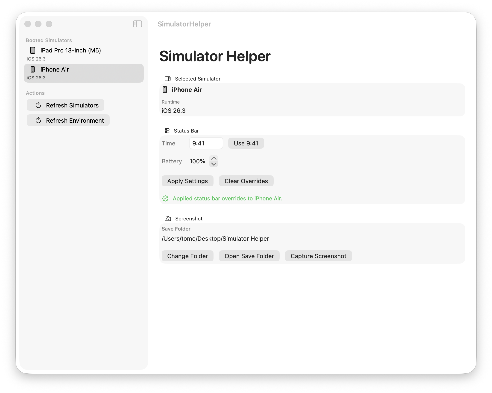

# Simulator Helper

**Set the iOS Simulator status bar time and battery, then capture a screenshot — all without touching the Terminal.**

Designed for iOS developers who prepare App Store screenshots and want a clean, consistent status bar every time.



---

## Download

**[→ Download SimulatorHelper-1.0.0.zip](https://github.com/tom-pudding/SimulatorHelper/releases/latest)**

1. Unzip and move `SimulatorHelper.app` to your Applications folder
2. Launch the app — Xcode must be installed, but does not need to be open

**Requirements:** macOS 15.0+, Xcode installed

---

## What you can do

| Feature | Details |
|--------|---------|
| **Set the time** | Type any time (e.g. `9:41` or `1041`) and click Apply Settings |
| **Set battery level** | Adjust 0–100 % with the stepper |
| **Capture a screenshot** | Saves a PNG to a folder of your choice |
| **Works with multiple simulators** | All booted iPhone and iPad simulators appear in the sidebar |
| **Remembers your settings** | Last-used time and battery level are restored on next launch |

The status bar changes take effect on the running simulator immediately.  
Hit **Clear Overrides** to restore the simulator's real status bar.

---

## How to use

1. Boot an iPhone or iPad simulator in Simulator.app
2. Open Simulator Helper — the simulator appears in the sidebar automatically
3. Enter a time and adjust battery level
4. Click **Apply Settings**
5. Click **Capture Screenshot**

---

## Build from source

```bash
git clone https://github.com/tom-pudding/SimulatorHelper.git
cd SimulatorHelper
./scripts/install_app.sh   # builds and installs to ~/Applications
swift test                  # run the test suite
```

---

## iOS 26 compatibility notes

Developing against the iOS 26 beta uncovered two `simctl status_bar` bugs.

### Bug 1 — Date override is broken

On iOS 26, every ISO 8601 date-time string passed to `--time` is rejected:

```
Invalid, non-ISO date/time string
```

No workaround was found. Date override is not available on iOS 26 simulators; only time-of-day can be set.

### Bug 2 — Times ending in :00 and the midnight hour are rejected

`11:00`, `9:00`, `0:30` — any time where the minute value is zero, or the hour value is zero, fails with the same error. Every alternative format (`11:00:00`, `11:00 AM`, `1100`, …) was tested and rejected.

**Workaround: minute overflow**

`simctl` accepts minute values ≥ 60 and normalises them on the device.  
Sending `10:60` causes the simulator to display `11:00`.

```
You type  →  Sent to simctl  →  Simulator shows
  11:00         10:60               11:00
  12:00         11:60               12:00
   1:00         23:120               1:00
   0:00         22:120               0:00
   0:30         22:150               0:30
   9:41          9:41                9:41
```

This is handled automatically inside `StatusBarConfiguration.simctlTimeArgument`.  
The UI always shows the time you typed; the rewrite is invisible.

---

## Project layout

```
Sources/SimulatorHelper/
  App/          entry point
  Models/       data structures
  Services/     simctl wrappers, screenshot, settings
  ViewModels/   AppViewModel (@Observable)
  Views/        SwiftUI views
Tests/SimulatorHelperTests/
scripts/
  build_app.sh        assemble .app bundle
  install_app.sh      build + install to ~/Applications
  generate_icon.swift regenerate AppIcon.icns from scratch
```

---

## License

MIT
